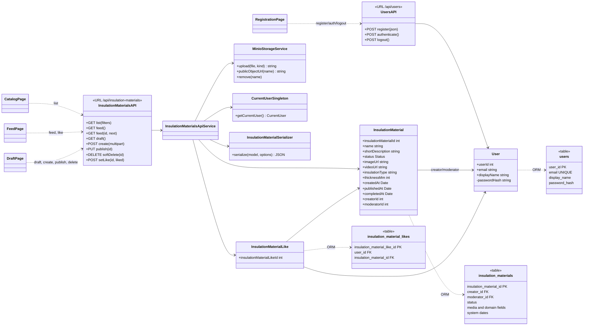

# Диаграмма классов лабораторной №3

```mermaid
classDiagram
direction LR

class CatalogPage
class FeedPage
class DraftPage
class RegistrationPage

class InsulationMaterialsAPI {
  <<URL /api/insulation-materials>>
  +GET list(filters)
  +GET feed()
  +GET feed(id, next)
  +GET draft()
  +POST create(multipart)
  +PUT publish(id)
  +DELETE softDelete(id)
  +POST setLike(id, liked)
}
class UsersAPI {
  <<URL /api/users>>
  +POST register(json)
  +POST authenticate()
  +POST logout()
}
class InsulationMaterialsApiService
class MinioStorageService {
  +upload(file, kind) string
  +publicObjectUrl(name) string
  +remove(name)
}
class CurrentUserSingleton {
  +getCurrentUser() CurrentUser
}
class InsulationMaterialSerializer {
  +serialize(model, options) JSON
}

class User {
  +userId int
  +email string
  +displayName string
  -passwordHash string
}
class InsulationMaterial {
  +insulationMaterialId int
  +name string
  +shortDescription string
  +status Status
  +imageUrl string
  +videoUrl string
  +insulationType string
  +thicknessMm int
  +createdAt Date
  +publishedAt Date
  +completedAt Date
  +creatorId int
  +moderatorId int
}
class InsulationMaterialLike {
  +insulationMaterialLikeId int
}

class users {
  <<table>>
  user_id PK
  email UNIQUE
  display_name
  password_hash
}
class insulation_materials {
  <<table>>
  insulation_material_id PK
  creator_id FK
  moderator_id FK
  status
  media and domain fields
  system dates
}
class insulation_material_likes {
  <<table>>
  insulation_material_like_id PK
  user_id FK
  insulation_material_id FK
}

CatalogPage ..> InsulationMaterialsAPI : list
FeedPage ..> InsulationMaterialsAPI : feed, like
DraftPage ..> InsulationMaterialsAPI : draft, create, publish, delete
RegistrationPage ..> UsersAPI : register/auth/logout
InsulationMaterialsAPI --> InsulationMaterialsApiService
InsulationMaterialsApiService --> InsulationMaterial
InsulationMaterialsApiService --> InsulationMaterialLike
InsulationMaterialsApiService --> MinioStorageService
InsulationMaterialsApiService --> CurrentUserSingleton
InsulationMaterialsApiService --> InsulationMaterialSerializer
UsersAPI --> User
InsulationMaterial --> User : creator/moderator
InsulationMaterialLike --> User
InsulationMaterialLike --> InsulationMaterial
User ..> users : ORM
InsulationMaterial ..> insulation_materials : ORM
InsulationMaterialLike ..> insulation_material_likes : ORM
```
